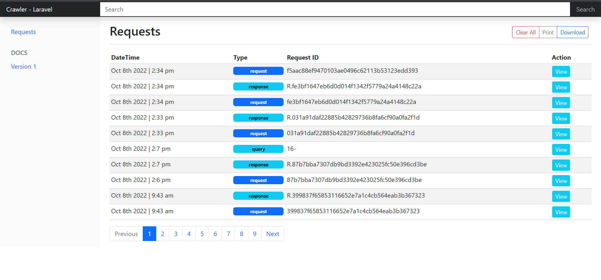

# Dagar/Crawler

The packages tries to provide 100% coverage for debugging your application by logging `request`, `response`, `quires` and `application logs` in one location and providing you one dashboard to look at all the things.

## Dashboard Screenshot


## Installation

```bash
composer install dagar/crawler
```

```bash
php artisan migrate
```

## Usage 

Goto `http://localhost:8000/crawl` to open dashboard and start debugging. 

The url and all other features can be configured from config file.

## Security

- IP Whitelist
- Useragent Whitelist
- Refer Header Whitelist

## License

